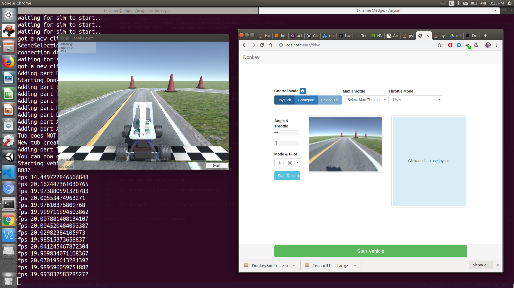

# 驴车模拟器
Donkey Gym项目是围绕自驾沙盒驴模拟器 ( )的OpenAI.
从源代码构建模拟器时，需要检查项目的donkey分支的sdsandbox。
该模拟器建立在Unity游戏平台上，使用其内部物理和图形，并连接到驴车Python进程，以使用我们训练的模型来控制模拟的驴车.
甚至通过脚本中的 multitrain.py 创建多个 AI 小车进行多车同时跑模拟器环境进行训练.
> 具体参见/donkeycar/donkeycar/scripts/multitrain.py

## 模拟器安装配置
### Windows系统
#### 安装环境依赖
> 注意: 已在Windows 10上测试过.
TBD

### Linux 系统
#### 安装环境依赖

> 注意: 已在Ubuntu 20.04 LTS上测试过.

* 打开一个终端(快捷键 Ctrl+ Alt + T)

* 下载并安装miniconda python3.7 64bit版本 [miniconda Python 3.7 64 bit](https://conda.io/miniconda.html). 

```bash
wget https://repo.anaconda.com/miniconda/Miniconda3-latest-Linux-x86_64.sh
bash ./Miniconda3-latest-Linux-x86_64.sh
```

* 创建项目目录并进入目录

```bash
mkdir projects
cd projects
```

* 从 Github 上下载最新的donkeycar 仓库.

```bash
git clone https://github.com/autorope/donkeycar
cd donkeycar
git checkout main
```

* 获取稳定版本

```bash
git clone https://github.com/autorope/donkeycar
cd donkeycar
git fetch --all --tags
latestTag=$(git describe --tags `git rev-list --tags --max-count=1`)
git checkout $latestTag
```

* 如果不是第一次安装donkeycar,需要更新Conda环境和移除旧的donkey库.

```bash
conda update -n base -c defaults conda
conda env remove -n donkey
```

*  创建 Python anaconda 的环境

```bash
conda env create -f install/envs/ubuntu.yml
conda activate donkey
pip install -e .[pc]
```

我们观察到`conda` 进行安装的时候非常慢, 两种方法,一种是换`mamba`,一种就换 Conda源.

```bash
conda install mamba -n base -c conda-forge
mamba env create -f install/envs/ubuntu.yml
conda activate donkey
pip install -e .[pc]
```

> 注意: 如果你是用 ZSH 的 shell, 需要转义一下\[pc\],因此你需要输入的不是
> `pip install -e . [pc]` 而是 `pip install -e . \[pc\]` 

* [可选]安装 Tensorflow GPU - 仅当你拥有 NVidia 图形加速卡的时候.

你需要先安装NVidia GPU的最新驱动,具体参考你显卡的类型去英伟达官方站点寻找.
Conda  会处理并安装正确的 cuda 和 cuddn 的库来匹配你的 Tensorflow 版本.

```bash
conda install tensorflow-gpu==2.2.0
```

* 创建你本地的工作目录:

```bash
cd projects/donkeycar
donkey createcar --path ../mycar
```

> 注意:如果关闭了 Anaconda 提示符后,重新打开就需要输入: 
> 输入 ```conda activate donkey``` 去重新映射到 donkey 的虚拟环境中.

----

### MacOS 系统

> 已经在 macOS Big Sur 11.6.5 环境下测试通过.

#### 安装环境依赖

* 安装 miniconda Python 3.7 64bit 版本 [miniconda Python 3.7 64 bit](https://conda.io/miniconda.html)

* 安装 git 64bit工具 [git 64 bit](https://www.atlassian.com/git/tutorials/install-git)

* 打开一个终端.

* 创建一个项目目录并进入其中.

```bash
mkdir projects
cd projects
```
* 从Github 下载最新的驴车仓库.

```bash
git clone https://github.com/autorope/donkeycar
cd donkeycar
git checkout main
```

* 获取稳定版本

```bash
git clone https://github.com/autorope/donkeycar
cd donkeycar
git fetch --all --tags
latestTag=$(git describe --tags `git rev-list --tags --max-count=1`)
git checkout $latestTag
```

* 如果不是第一次安装,更新 Conda并且删除旧的donkey虚拟环境 

```bash
conda update -n base -c defaults conda
conda env remove -n donkey
```

* 创建Python anaconda虚拟环境

```bash
conda env create -f install/envs/mac.yml
conda activate donkey
pip install -e .[pc]
```

安装 mamba 并通过 mac.yml 文件安装 pyhton 的依赖库.

```bash
conda install mamba -n base -c conda-forge
mamba env create -f install/envs/mac.yml
conda activate donkey
pip install -e .[pc]
```

> 注意: 如果你是用 ZSH 的 shell, 需要转义一下\[pc\],因此你需要输入的不是
> `pip install -e . [pc]` 而是 `pip install -e . \[pc\]` 

* [可选]安装 Tensorflow GPU - 仅当NVidia 图形加速卡的时候.

你需要先安装NVidia GPU的最新驱动,具体参考你显卡的类型去英伟达官方站点寻找. Conda  会处理并安装正确的 cuda 和 cuddn 的库来匹配你的 Tensorflow 版本.

```bash
conda install tensorflow-gpu==2.2.0
```

* Tensorflow GPU

不过可惜的是当前似乎没有NVidia gpu 能在 Mac 上支持 tensorflow, 详情请参考: [tensorflow on mac](https://www.tensorflow.org/install#install-tensorflow).

*  创建你本地的工作目录:

```bash
donkey createcar --path ../mycar
```

###  DonkeyGYM 安装配置

您可以通过将模拟器视为虚拟硬件来了解和使用标准的 Donkeycar 驾驶/训练/测试的整个流程
您将使用与使用真实驴车相同的命令来收集数据、驾驶和训练。



* 安装
1. 从[Donkey Gym Release](https://github.com/tawnkramer/gym-donkeycar/releases)下载模拟器并解压到驴车项目目录.
2. 建议将安装路径默认放置在: ~/projects/DonkeySimLinux
3. 确保完成了donkeycar驴车的环境配置步骤,如果未完成请[安装Donkeycar环境](gym_simulator.md#donkeycar)
4. 设置 DonkeyGym：

```bash
cd ~/projects
git clone https://github.com/tawnkramer/gym-donkeycar
cd gym-donkeycar
conda activate donkey
pip install -e .[gym-donkeycar]
```

* 你可以使用之前创建的驴车实例环境`mycar`,但是为了便于区分,我们建议新创建一个模拟器的实例.

```bash
donkey createcar --path ../mysim
cd ../mysim
```

*  编辑你的`myconfig.py` 去启用 Donkey GYM 环境.替换 `<user-name>` 和其他部分的路径, 例如你的 donkey_sim 的模拟器的位置:
** 本地模拟器
本地模拟器表示您将使用您本地的模拟器环境进行驴车的数据采集, 训练,自动驾驶等操作.

```bash
DONKEY_GYM = True
DONKEY_SIM_PATH = "/home/<user-name>/projects/DonkeySimLinux/donkey_sim.x86_64"
DONKEY_GYM_ENV_NAME = "donkey-generated-track-v0"
```

** 远程模拟器
远程模拟器就是允许您通过互联网连入驴车服务器并和互联网上的用户进行驴车模拟驾驶,同时采集数据到本地,采集完成后,可以在本地完成数据筛选和模型训练.
然后再利用训练好的模型进行比赛.

```bash
WEB_CONTROL_PORT = 8880
WEB_INIT_MODE = "local"
DONKEY_GYM = True
DONKEY_GYM_ENV_NAME = "donkey-generated-track-v0"
DONKEY_SIM_PATH = "remote"
SIM_HOST = "race.donkeydrift.com"
SIM_PORT = 9091
GYM_CONF = { "body_style" : "car01", "body_rgb" : (255, 0, 255), "car_name" : "<YOUR_NAME>", "font_size" : 100}
GYM_CONF["racer_name"] = "<YOUR_NAME>"
GYM_CONF["country"] = "Shanghai"
GYM_CONF["bio"] = "<YOUR_BIO>"
GYM_CONF["guid"] = "0"
```

> 注意: 这里的主要需要设置 DONKEY_SIM_PATH = "remote" 
> 另外对于本地用户的 DONKEY_SIM_PATH设置一定是 DonkeySimLinux 模拟器安装的路径.
> 
>  Windows: DonkeySimWin/donkey_sim.exe
>  Mac OS: DonkeySimMac/donkey_sim.app/Contents/MacOS/donkey_sim
>  Linux: DonkeySimLinux/donkey_sim.x86_64
>  Mac OS 和 Linux 系统中,需要对模拟器的二进制文件赋权.

```bash
chmod +x DonkeySimMac/donkey_sim.app/Contents/MacOS/donkey_sim
```

或

```bash
chmod +x DonkeySimLinux/donkey_sim.x86_64
```

### 驾驶 
在确保当前环境在 donkey 的虚拟环境下的情况下,就是终端命令提示符前方类似: `(donkey)[username@localhost ~]$`
如果是`(base)`, 请在终端输入:

```bash
conda activate donkey
```

启动驾驶:

```bash
python manage.py drive
```

这时候,当你的模拟器是本地模拟器的时候,会自动启动 unity的程序,并可以通过网页端访问 [http://localhost:8887/drive](http://localhost:8887/drive)看到控制页面.
> 如果您目前有一个 PS3/XBOX 手柄, 那么可以接入你的电脑,在网页端选择 `joystick` 方式进行控制.只有在 Ubuntu Linux下,
> 你可以插入你的手柄,在系统中会识别成一个字符设备, 位置在`/dev/input/js0`
> 你可以编辑 `myconfig.py` 文件去添加你的摇杆的模型和使用`--js`
> 参数来运行驾驶时使用的程序.

```bash
python manage.py drive --js
```

在模拟器中的车辆行驶起来后, 它将会在本地的 data 目录中创建 tub 记录,这里的记录里面包含图片,当前的油门和转向信息.

### 训练 

* 本地训练

如果您本地主机性能卓越,并且当前您没有远程云端服务器提供训练服务,您可以直接在本地对数据集进行训练并生成你想要的模型.

```bash
donkey train --tub ./data --model models/mypilot.h5
```
* Azure云端训练

如果使用 Azure 云端主机进行训练,则需要将数据打包并通过 scp
等远程传输的方式传输到云端的驴车环境中进行训练, 训练的命令与本地训练一致.
打包数据并上传云端命令类似:

```bash
tar -cvzf data.tar.gz  ./data 
scp -i donkeycar.pem -P50001 data.tar.gz azureuser@云端主机 IP 地址( 比赛前会分发给各位选手):/home/azureuser/ 
```

### 测试训练效果(自动驾驶)

和驾驶时使用的命令类似, 只是在自动驾驶时,添加`--model` 参数及模型文件的相对路径.

```bash
python manage.py drive --model models/mypilot.h5
```

然后通过网页控制端,设置`Mode and Pilot` 为 `Full Pilot`, 这时候模拟的驴车就开始自动驾驶了.

---
