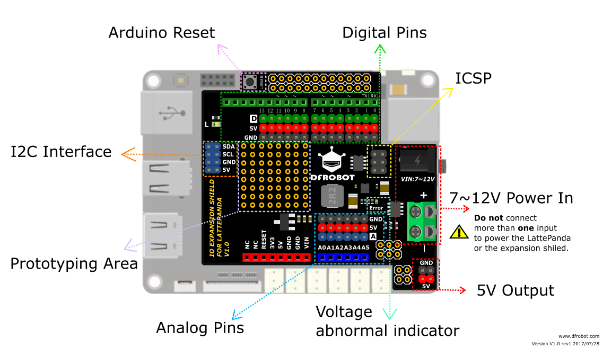
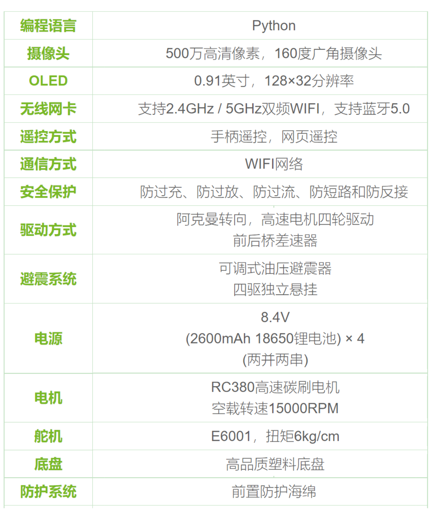
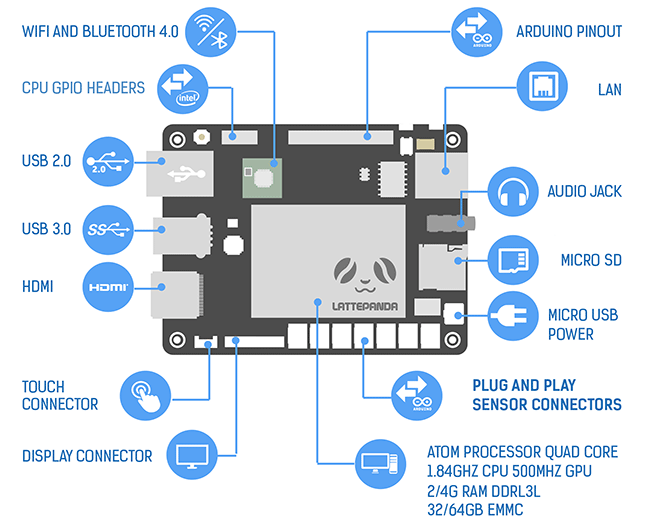
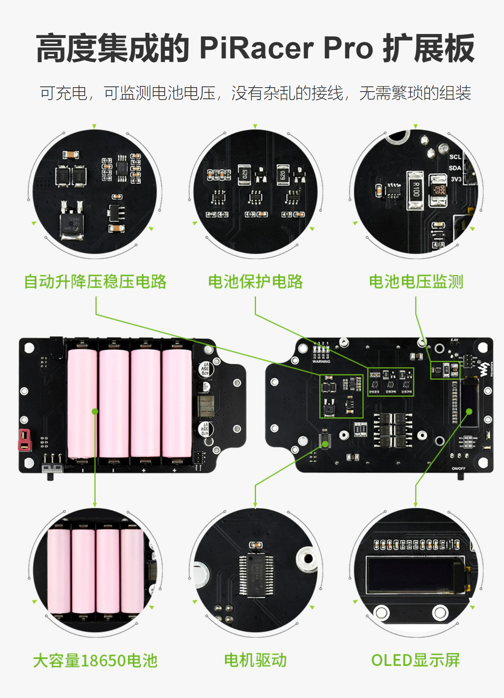

#  硬件架构

##  硬件组成123

## 主控部分

DFRobot LattePanda v1 Intel X86_Arch 开发板
[LattePanda_v1.0](https://wiki.dfrobot.com.cn/LattePanda_V1_0#target_6)

* Arduino Leonardo 开发板
[LattePanda扩展板](https://www.dfrobot.com.cn/goods-1529.html)

* Intel Neural Compute Stick 2 (NCS2)
[NCS2](https://www.intel.com/content/www/us/en/developer/tools/neural-compute-stick/overview.html?wapkw=Intel%C2%AE%20Neural%20Compute%20Stick%202)

## 执行部分

* 微雪 Ai 自动驾驶小车供电板
[赛车底盘](https://www.waveshare.net/wiki/PiRacer_Pro_AI_Kit)

* 舵机
* 电调

## 通信部分

* 4通道高电压逻辑与低电压逻辑双向转换器
[电平转换模块](https://wiki.dfrobot.com.cn/_SKU_DFR0843_4-Bit_Level_Translator)

* 天线
* 小飞象枪控套件

## 传感部分

* USB 摄像头
[USB摄像头](https://wj10gz7r7t.feishu.cn/wiki/wikcnJ5D00TZdovpTemvdShQgwd)

## 电源部分

* 充电器 8.4V 
* 电池 18650 3.7V (两并两串)

## 安装工具

* M2.5螺丝刀
* 电烙铁
* 焊锡
* 吸锡器
* 洗板水
* 镊子
* 双面胶
* 杜邦线
* 扎带

## 测试工具

* HDMI线缆
* 支持 HDMI的屏幕
* 蓝牙无线键鼠套装
* 万用表
* [可选]硬件视频卡

---
