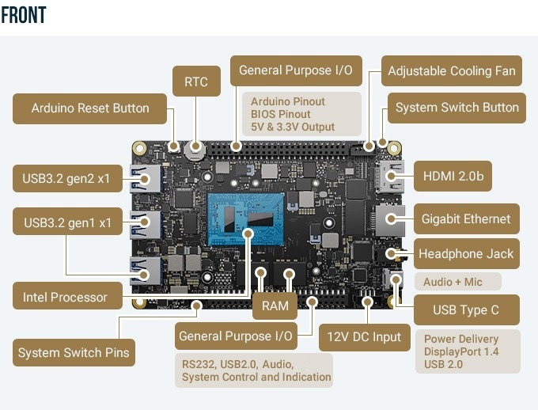
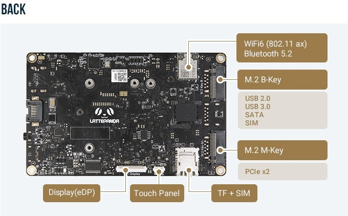

# 硬件架构

## 硬件组成

## 主控部分

- DFRobot LattePanda 3 Delta Intel X86_Arch 开发板
  [LattePanda 3 Delta](https://www.lattepanda.com/lattepanda-3-delta)

## 执行部分

* 专用驱动板+ESP32-C3芯片
* 四驱车底盘

## 通信部分

* 天线
* 小飞象枪控套件

## 传感部分

* [USB摄像头](https://wj10gz7r7t.feishu.cn/wiki/wikcnJ5D00TZdovpTemvdShQgwd)

## 电源部分

* 充电器 8.4V
* 电池 18650 3.7V (两并两串)

## 安装工具

* M2.5螺丝刀
* 电烙铁
* 焊锡
* 吸锡器
* 洗板水
* 镊子
* 双面胶
* 杜邦线
* 扎带

## 测试工具

* HDMI线缆
* 支持 HDMI的屏幕
* 蓝牙无线键鼠套装
* 万用表
* [可选]硬件视频卡

---
