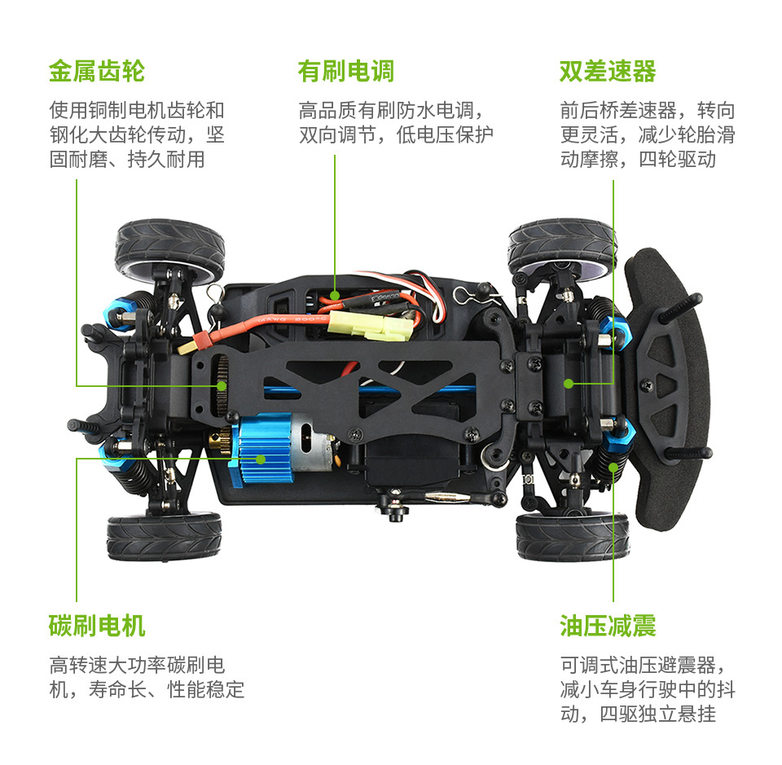
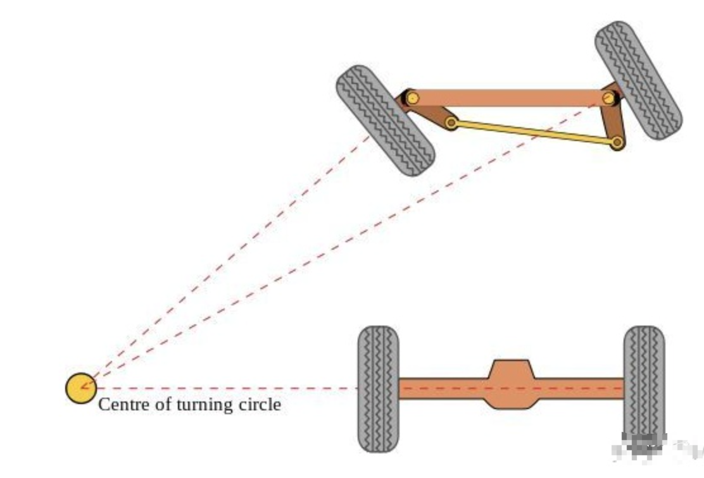
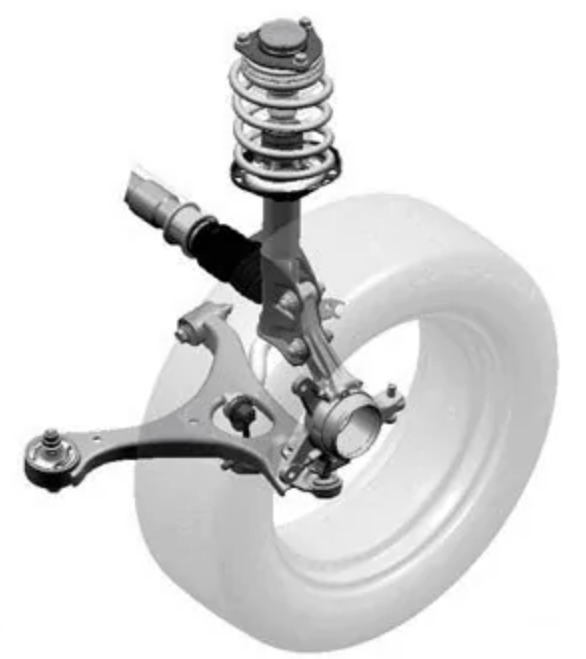
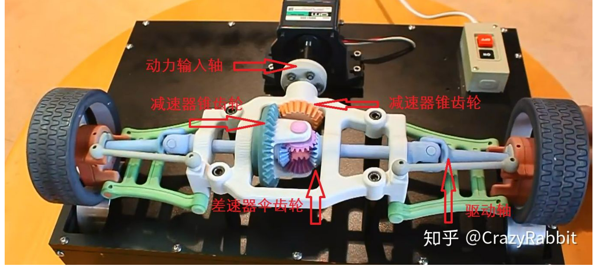
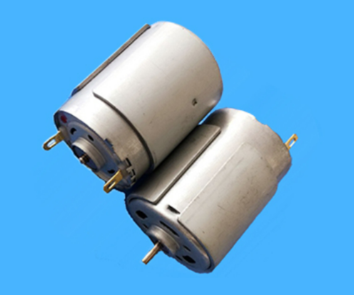
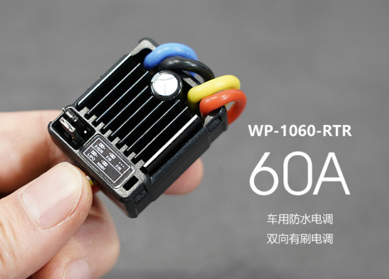
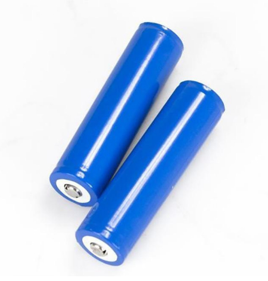
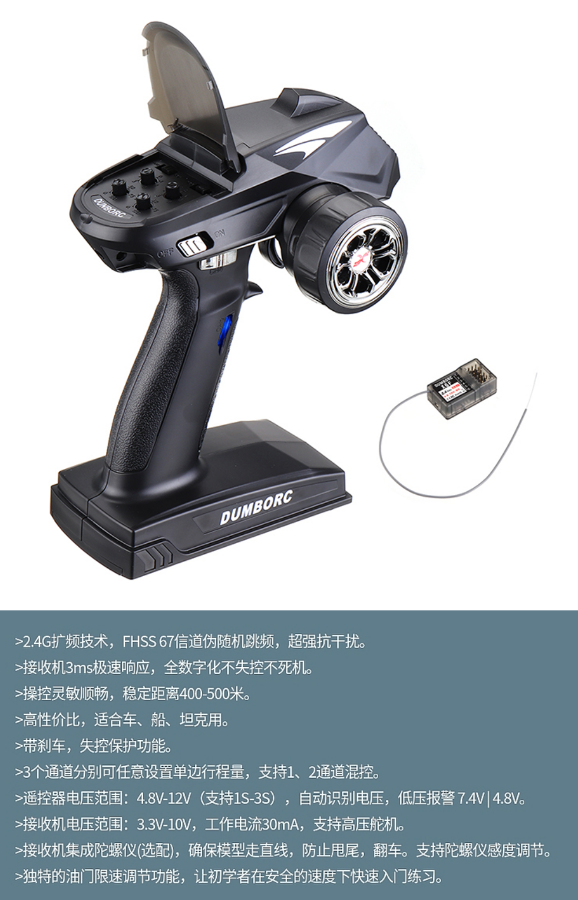

# 机械架构
## 机械组成

## 转向系统

[阿克曼转向](https://zhuanlan.zhihu.com/p/95744069)是一种现代汽车的转向方式，在汽车转弯的时候，内外轮转过的角度不一样，内侧轮胎转弯半径小于外侧轮胎。下图就是理想的阿克曼转向。

## 避震悬挂系统

[麦弗逊式悬架](https://baike.baidu.com/item/%E9%BA%A6%E5%BC%97%E9%80%8A%E5%BC%8F%E6%82%AC%E6%9E%B6/10934713)是汽车安全结构的重要组成部分，一直以来，汽车的行驶操控性和舒适性与底盘结构中的悬挂系统息息相关，而悬挂结构的简单与复杂也直接决定着汽车制造成本的高低。麦弗逊式独立悬架是众多悬挂系统中的一种，它以结构简单、成本低廉、舒适性尚可的优点赢得了广泛的市场应用。

##  差速系统

[前后桥差速器](https://zhuanlan.zhihu.com/p/39789612)使得动力输出轴上的两侧车轮断开耦合，实现不等速，从而流畅转弯。

##  动力三电

> 电机: [高速微型直流电机380 有刷](http://www.szpcdj.cn/product15/product29.html)

> 电调: [防水RC有刷电调](https://item.taobao.com/item.htm?spm=a230r.1.14.37.b487621blWtDdd&id=616032835995&ns=1&abbucket=16#detail)全称电子调速器，英文Electronic Speed Control，简称ESC。 针对电机不同，可分为有刷电调和无刷电调。 它根据控制信号调节电动机的转速。

> 电池: [18650锂电池](https://baike.baidu.com/item/18650锂电池/4723898)

##  遥控系统

> RC枪控: `6通道`, 频段:`2.4GHz`, 信号协议: `PPM/PWM` (航模遥控器标准协议)

> 接收机: 电压:`3.3V~5V`, `6 通道`, 频段: `2.4GHz` 

[RC枪控遥控器与接收机](https://item.taobao.com/item.htm?spm=a230r.1.14.39.559e60b0CqGd0e&id=594835276411&ns=1&abbucket=16#detail)

