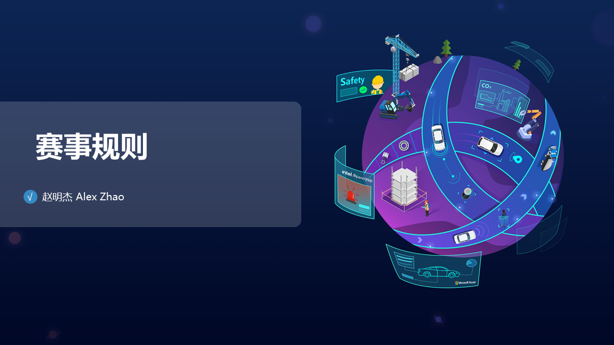
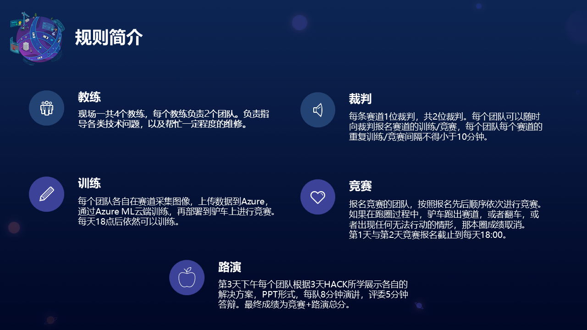
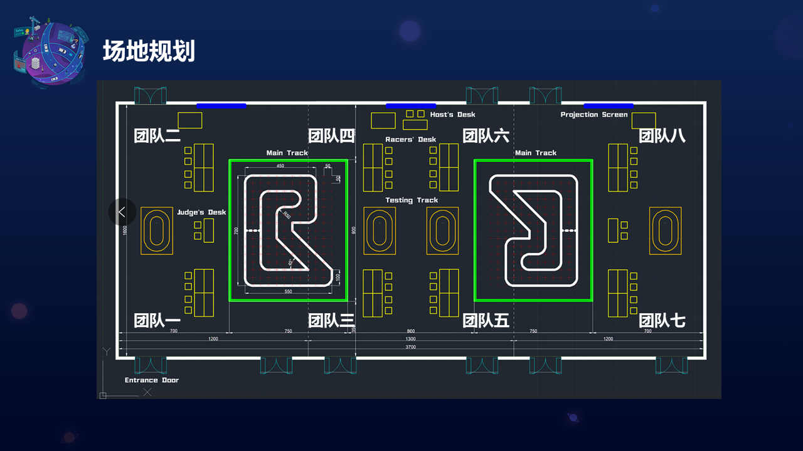
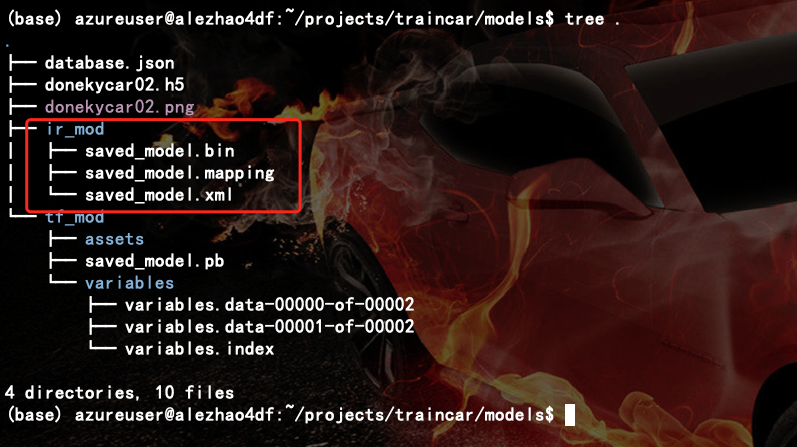
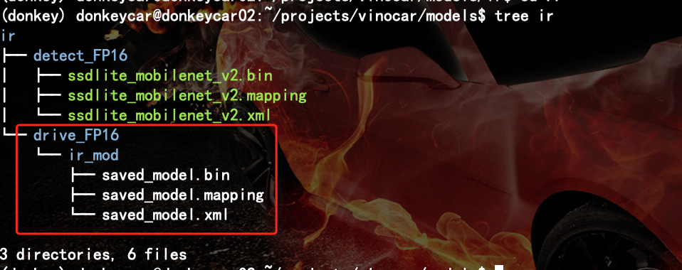

# 线下比赛

## 比赛规则








---

## 比赛安排

TBD

---

## 奖项评选

TBD

---

## 操作流程 
一般情况下,驴车安装配置完成后,可通过Wi-Fi连入网络,建议通过远程终端软件登录驴车进行调试.

常见远程登录软件

* [putty](https://www.putty.org/)
* [mobaxterm](https://mobaxterm.mobatek.net/)
* [SecureCRT](https://www.vandyke.com/products/securecrt/)
* [Xshell](https://www.netsarang.com/en/xshell/)

登录信息

* 用户名: `donkeycar`
* 密码: `donkeycar`
* IP地址: 请在比赛现场联网后通过下面命令获取.

```
hostname -I
```
或

```
ifconfig wlan0
```

驴车项目路径

驴车项目位于`/home/donkeycar/projects`目录, 请在远程登录系统后,通过`cd` 命令切换至该目录,并确认当前为`(donkey)`虚拟环境.
如果当前位于:`(base)[donkeycar@donkeycar0X ~]$`

> 此时是conda 基础环境需要切换至驴车环境.

```
conda activate donkey 
```

如果需要退出虚拟环境:
```
conda deactivate donkey 
```

### 启动驴车

#### 操作步骤
在终端输入:

```
python manage.py  drive
```

驴车启动后,终端会被占用,如果需要终止驴车运行请在键盘按下: `ctrl + c`

### 网页端控制


默认情况下,驴车在启动后会通过tornado 库实现一个简单的web页面,该页面可用于监控驴车行驶状态及网页端控制,可通过浏览器访问驴车IP
地址及端口来获取.

* 网页端打开

```
http://驴车当前IP地址:8887 端口
```

> 默认端口: 8887 
> 驴车在驾驶过程中,会不断通过摄像头采集图片信息并整合当前的角度和油门值存储在`data`目录.
> 在执行终端中可以通过键盘输入: CTRL + C 结束采集. 

### 压缩打包数据 

为上传到Azure 进行云端进行训练,加快训练进程.

```
cd /home/pi/projects/mycar/ 
tar -czvf data.tar.gz  data/ 
ls  
```

> 如果有 data.tar.gz 的红色压缩包就好. 

### 上传云主机 

* 通过`scp`命令拷贝

```
scp -P50001 data.tar.gz -i DONKEYCAR_KEY.pem azureuser@AZURE_SERVER_IP:/home/azureuser/mycar/
```
### 训练方法

* 通过ssh 命令登陆到Azure云服务器,其中需要使用对应的KEY,和对应的端口登陆,其中部分云主机开放的端口是`50000`, 部分是`50001`, 请根据实际对应的服务器数据添加. 

```
ssh -p 50001 -i /home/donkeycar/hackauto06-gpu.pem azureuser@[Azure GPU Server]
```

* 进入项目目录并解压采集的数据并在 Azure GPU服务器上训练Keras 模型.  

```
cd mycar
tar -xf data.tar.gz  
donkey train --tub data/[TUB_SUB_DATA]/  --model models/[MODEL_NAME].h5
```

> 请确认数据包加压到`/home/azureuser/mycar/data` 目录.

### 创建Tensorflow 模型路径和 openVINO 模型路径

```
cd modules
mkdir tf
mkdir ov 
```

训练完成后会在驴车实例的 models 目录中生成模型文件. 由于默认训练出来的模型类型是:`keras`
需要转换为`tensorflow`类型,再转换成`OpenVINO`能识别的类型.
* 转换模型: 将模型从 Keras 转换为 Tensorflow.

```bash
cd ..
python convert_keras2tf.py --from models/[MODEL_NAME].h5 --to models/tf/
```

其中转换脚本convert_keras2tf.py 示例代码:

```python
import tensorflow as tf
import os
import sys

'''
--from: keras mode path .h5 e.g. /PATH/TO/[YOUR_CAR_INSTANCE]/models/[YOUR_MODEL_NAME].h5
--to: converted openvino path to e.g. /PATH/TO/[YOUR_CAR_INSTANCE]/models/[OPENVINO_IR_MODEL_PATH]/
'''
os.environ['TF_XLA_FLAGS'] = '--tf_xla_enable_xla_devices'

if __name__ == '__main__':
    args = sys.argv[1:]
    if len(args) == 4:
        if args[0] == '--from':
            model = tf.keras.models.load_model(args[1])
        if args[2] == '--to':
            tf.saved_model.save(model,args[3])
```

* 将Tensorflow模型转换成OpenVINO模型. 

> PS: 这里需要手动添加一个 库: defusedxml

```bash
conda install defusedxml
python /opt/intel/openvino_2021/deployment_tools/model_optimizer/mo.py --saved_model_dir models/tf --input_shape [1,120,160,3] -o models/ov --data_type FP16
```
查看一下数据结构:

```bash
sudo apt -y install tree
tree .

```



* 打包压缩OpenVINO模型文件

```bash
cd models
tar -czvf ov.tar.gz ov/
```

* 退出Azure GPU 服务器,回到驴车本地环境中.
```
exit
```

> 注意: 目前需要保证当前环境已经回到 DonkeyCar 环境中.可以通过检查主机名和登陆用户判断

* 从 Azure 云服务器下载 OpenVINO 模型文件并解压.

```bash
cd projects/vinocar/
scp -P50001 -i /home/donkeycar/hackauto06-gpu.pem azureuser@[Azure GPU Server]:/home/azureuser/mycar/models/ov.tar.gz models/
cd models
tar -xf ov.tar.gz
```
模型存放位置如下图



### 自动驾驶

* 网页控制

通过浏览器访问`http://驴车当前IP地址:8887/`, 替换驴车地址信息为驴车设别地址信息.

先点击页面下方的: `start vehicle`按钮然后在 `Mode & Pilot` 选择`Full Pilot`小车就开始自行驾驶了. 

需要终止请在终端上按下 `Ctrl + C`

> 此时, 需要开启遥控器的 `Channel3` 按钮(手柄左手大拇指位置) 来解锁油门.
> 以上所有操作需要在拥有硬件驴车和 azure 云服务器的情况下进行.

---
