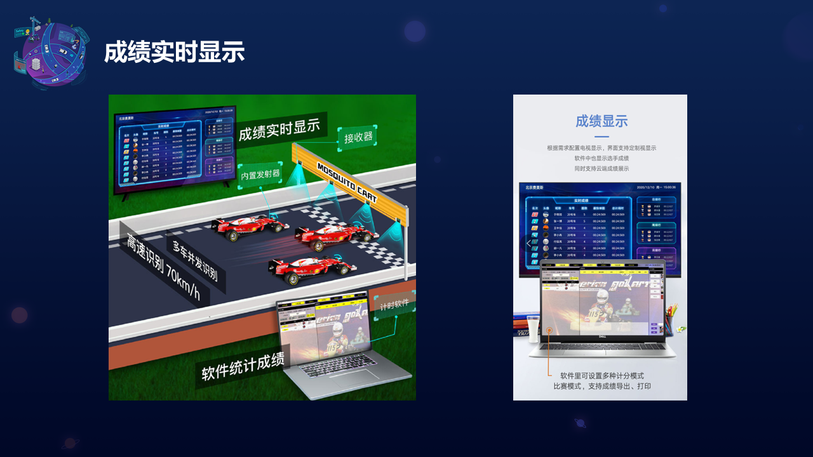

# 线下比赛

## 比赛规则




---

## 评分规则


---

## 比赛安排


---

## 奖项评选


---

## 操作流程 
* 驴车开机
驴车在开机前,大家请检查驴车硬件线缆是否松动,例如检查 USB 摄像头状态,Intel神经棒连接是否稳定,并且去掉镜头盖,打开侧面电源开关,并且等待 LattePanda 自检完成,自检过程中,红色的 LED 灯会以 50Hz 的频率闪烁,等待红色LED 关闭后,请按下 LattePand 底板侧面靠近网卡接口处的白色按钮,第一个按钮为重置按钮, 第二个按钮是开关机按钮,按下后红色LED 灯长亮即进入启动状态.
```
PS: 建议此时将 HDMI 线缆接入 LattePanda. 
```
* 驴车启动完成
一般情况下,驴车安装配置完成后,可通过Wi-Fi连入网络,建议通过远程终端软件登录驴车进行调试.

常见远程登录软件

* [putty](https://www.putty.org/)
* [mobaxterm](https://mobaxterm.mobatek.net/)
* [SecureCRT](https://www.vandyke.com/products/securecrt/)
* [Xshell](https://www.netsarang.com/en/xshell/)

登录信息

* 用户名: `donkeycar`
* 密码: `donkeycar`
* IP地址: 请在比赛现场联网后通过下面命令获取.

```
hostname -I
```
或

```
ifconfig wlan0
```

驴车项目路径

驴车项目位于`/home/donkeycar/projects/vinocar`目录, 请在远程登录系统后,通过`cd` 命令切换至该目录,并确认当前为`(donkey)`虚拟环境.
如果当前位于:`(base)[donkeycar@donkeycar0X ~]$`

> 此时是conda 基础环境需要切换至驴车环境.

```
conda activate donkey 
```

如果需要退出虚拟环境:
```
conda deactivate donkey 
```

### 启动驴车

#### 操作步骤
在终端输入:

```
python manage.py drive
```
* 驴车启动画面:


驴车启动后,终端会被占用,如果需要终止驴车运行请在键盘按下: `ctrl + c`

如果进程没有终止,可以执行`sudo ./kill_process.sh` 脚本来执行自动杀进程操作.

`PS: 当遇到错误提示camera index out of range 错误时, 请尝试杀掉驴车进程, 并尝试检查 USB 摄像头是否松动.`

### 网页端控制

默认情况下,驴车在启动后会通过tornado 库实现一个简单的web页面,该页面可用于监控驴车行驶状态及网页端控制,可通过浏览器访问驴车IP
地址及端口来获取.

* 网页端打开

```
http://[驴车当前IP地址]:8887 端口
```
PS: 请替换`[ ]` 括起来的内容为当前驴车的IP.

> 默认端口: 8887 
> 驴车在驾驶过程中,会不断通过摄像头采集图片信息并整合当前的角度和油门值存储在`data`目录.
> 在执行终端中可以通过键盘输入: CTRL + C 结束采集. 

### 压缩打包数据 

数据采集完成后,可以在本地训练或者通过将数据上传到Azure 云端进行训练, 可以加快训练进程,减少训练所需要的时间,也可以通过本地训练,但是时间较长不推荐.

```
cd /home/donkeycar/projects/vinocar/ 
tar -czvf data.tar.gz  data/ 
ls  
```

> 如果有 data.tar.gz 的红色压缩包就好. 

### 上传云主机 

* 通过`scp`命令拷贝数据至Azure云主机.

```
cd /home/donkeycar/projects/vinocar/
scp -P 50001 -i [DONKEYCAR_KEY.pem] data.tar.gz azureuser@[AZURE_SERVER_IP]:/home/azureuser/mycar/
```
-P 指定端口号, 请确认云端服务器提供端口信息,可以咨询裁判或者工作人员.
-i 指定登陆秘钥. 请替换`[]`中的秘钥内容, 默认路径为"/home/donkeycar/hackautoXX-gpu.pem", 请在驴车用户属主目录中确认.
请酌情替换`[AZURE_SERVER_IP]`的内容为您队伍所使用的 Azure 云主机 IP 地址.
 
### 训练方法

* 通过ssh 命令登陆到Azure云服务器,其中需要使用对应的KEY,和对应的端口登陆,其中部分云主机开放的端口是`50000`, 部分是`50001`, 请根据实际对应的服务器数据添加. 

```
ssh -p 50001 -i [DONKEYCAR_KEY.pem]  azureuser@[AZURE_SERVER_IP]
```
-p 注意这里是小写`p`, 同样指定端口信息
-i 执行驴车登陆云平台秘钥. 默认路径在:`/home/donkeycar/hackautoXX-gpu.pem`, 请自行检查.
请酌情替换`[]`内容为当前驴车的秘钥信息和队伍所使用的 Azure 云平台服务器地址信息.

* 进入项目目录并解压采集的数据并在 Azure GPU服务器上训练Keras 模型.  

```
cd /home/azureuser/mycar
tar -xf data.tar.gz  
donkey train --tub data/[TUB_SUB_DATA]/  --model models/[MODEL_NAME].h5
```
PS: 请根据实际情况替换`[]`内部信息.

> 请确认数据包加压到`/home/azureuser/mycar/data` 目录.

### 创建Tensorflow 模型路径和 openVINO 模型路径

```
cd /home/azureuser/mycar/models/
mkdir tf
mkdir ov 
```

训练完成后会在驴车实例的 models 目录中生成模型文件. 由于默认训练出来的模型类型是:`keras`, 需要转换为`tensorflow`类型,再转换成`OpenVINO`能识别的类型.

* 转换模型: 将模型从 Keras 转换为 Tensorflow.

```bash
cd /home/azureuser/mycar/
python convert_keras2tf.py --from models/[MODEL_NAME].h5 --to models/tf/
```

其中转换脚本convert_keras2tf.py 示例代码:

```python
import tensorflow as tf
import os
import sys

'''
--from: keras mode path .h5 e.g. /PATH/TO/[YOUR_CAR_INSTANCE]/models/[YOUR_MODEL_NAME].h5
--to: converted openvino path to e.g. /PATH/TO/[YOUR_CAR_INSTANCE]/models/[OPENVINO_IR_MODEL_PATH]/
'''
os.environ['TF_XLA_FLAGS'] = '--tf_xla_enable_xla_devices'

if __name__ == '__main__':
    args = sys.argv[1:]
    if len(args) == 4:
        if args[0] == '--from':
            model = tf.keras.models.load_model(args[1])
        if args[2] == '--to':
            tf.saved_model.save(model,args[3])
```

* 将Tensorflow模型转换成OpenVINO模型. 

> PS: 这里需要手动添加一个 库: defusedxml

```bash
yes | conda install defusedxml
python /opt/intel/openvino_2021/deployment_tools/model_optimizer/mo.py --saved_model_dir models/tf --input_shape [1,120,160,3] -o models/ov --data_type FP16
```
查看一下数据结构:

```bash
sudo apt -y install tree
tree .

```


* 打包压缩OpenVINO模型文件

```bash
cd /home/azureuser/mycar/models/
tar -czvf ov.tar.gz ov/
```

* 退出Azure GPU 服务器,回到驴车本地环境中.
```
exit
```

> 注意: 目前需要保证当前环境已经回到 DonkeyCar 环境中.可以通过检查主机名和登陆用户判断

* 从 Azure 云服务器下载 OpenVINO 模型文件并解压.

```bash
cd /home/donkeycar/projects/vinocar/
scp -P50001 -i [DONKEYCAR_KEY.pem] azureuser@[AZUER_SERVER_IP]:/home/azureuser/mycar/models/ov.tar.gz models/
cd models
tar -xf ov.tar.gz
```
PS: 这里请酌情替换`[]`括号内的内容为当前驴车的秘钥和云端服务器 IP 地址.

模型存放位置如下图


### 自动驾驶

* 网页控制

通过浏览器访问`http://[驴车当前IP地址]:8887`, 替换驴车地址信息为驴车设备地址信息.

先点击页面下方的: `start vehicle`按钮然后在 `Mode & Pilot` 选择`Local Pilot`, 表示本地自动驾驶, 然后将枪控上的`CH3` 按钮按下并确保`CH4` 推到最右侧(靠近舵轮方向), 如果由于采集数据时油门不够导致的无法自动驾驶,可以尝试将`CH4`拨到中间档位, 使得油门控制扳机仍然能够控制驴车油门,但是转向仍然使用自动驾驶, 如果`CH4`完全拨到左边(靠近握把位置),则枪控完全接管驴车的油门和转向,进入人工控制模式.
驾驶终止请在终端上按下 `Ctrl + C`, 并及时按下枪控`CH3` 按钮来锁定油门.

> 以上所有操作需要在拥有硬件驴车和 azure 云服务器的情况下进行.

---
