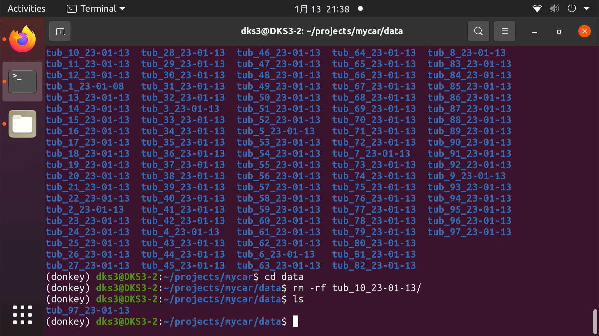

# 操作流程 

* 驴车开机
 
> 注意! 注意! 注意!  重要的问题强调三遍!!!<br>

> 操作不规范, 驴友两行泪!<br>

> 下面几条内容请大家一定要注意并互相转告!<br>

> 1. 车辆在调试过程中一定要保证车辆稳定的停放在车架上,四轮必须离开桌面.<br>

> 2. 在调试过程中,请确保`CH3` 保持在锁定状态(灯灭掉的状态)<br>

> 3. 禁止任何液体进入到车体内部,会造成短路.<br>

> 4. 请保护好各种电缆,并且保护好镜头.<br>

> 5. 严禁任何带电操作接口设备, USB 和 HDMI 除外.<br>

驴车在开机前,大家请检查驴车硬件线缆是否松动.
1. 例如检查 USB 摄像头状态
2. 是否已经去掉镜头盖
3. 接入电池后 LattePanda Delta 3(下文中将使用 LPD3 代替) 会自动开机并接入钛星人路由器提供的网络环境.

4. 按下自锁开关旁边的轻触按键给下位机供电,并且给电调上电.

>
```
PS: 建议此时将 HDMI 线缆接入LPD3 HDMI 接口, 并接入键盘鼠标等外设,也可以通过SSH 远程登录驴车环境进行命令行操作.
```
* 驴车启动完成
一般情况下,驴车安装配置完成后,可通过Wi-Fi连入网络,建议通过远程终端软件登录驴车进行调试.

常见远程登录软件

* [putty](https://www.putty.org/)
* [mobaxterm](https://mobaxterm.mobatek.net/)
* [SecureCRT](https://www.vandyke.com/products/securecrt/)
* [Xshell](https://www.netsarang.com/en/xshell/)

登录信息

* 用户名: `dks3`
* 密码: `donkeycar`
* IP地址: 请在比赛现场联网后通过下面命令获取.

```
hostname -I
```
或

```
ifconfig wlan0
```
默认情况下请不要随便更改 IP 地址,因为我们做了 MAC 地址绑定,需要查询 IP 地址也可以询问工作人员:昊男或漂移菌.

驴车项目路径

驴车项目位于`/home/dks3/projects/mycar`目录, 请在远程登录系统后,会自动进入驴车项目目录,不再需要使用`conda active donkey`激活环境了.

> `/home/dks3/projects/mycar` 目录结构如下图:


### 数据采集

#### 操作步骤
在默认情况下,我们提供了一个测试用的模型文件放在models 目录中,作为默认启动时调用的模型文件, 切记添加参数`--model models/ov/save_model.xml` 作为第一次启动驴车进行数据采集的参数,否则会报错. 当采集好数据并训练完成后,可以将模型路径替换为训练好的新模型路径来实现自动改驾驶. 

在终端输入:

```
python manage.py drive --model models/ov/saved_model.xml
```
* 驴车启动画面:


驴车启动后,终端会被占用,并快速输出`TXXSYY` 类型的数据,其表示当前接受到的油门和转向信息.
例如: `T80S20` 表示T(Throttle)当前油门达到80%, S(Steering)当前转向达到20%, 如果需要终止驴车运行请在键盘按下: `ctrl + c`

如果进程没有终止,可以执行`sudo ./kill_process.sh` 脚本来执行自动杀进程操作.

`PS: 当遇到错误提示camera index out of range 错误时, 请尝试杀掉驴车进程, 并尝试检查 USB 摄像头是否松动.`

### 网页端控制

默认情况下,驴车在启动后会通过tornado 库实现一个简单的web页面,该页面可用于监控驴车行驶状态及网页端控制,可通过浏览器访问驴车IP 地址及端口来获取.

* 网页端打开

```
http://[驴车当前IP地址]:8887 端口
```
PS: 请替换`[ ]` 括起来的内容为当前驴车的IP.


> 默认端口: 8887 
> 驴车在驾驶过程中,会不断通过摄像头采集图片信息并整合当前的角度和油门值存储在`data`目录中,每次执行`python manage.py drive --model [MODELES_PATH]` 命令时,都会在 data 目录中产生一个 tub_数字_年_月_日的目录,并将采集的图片和油门转向的归一化数值存储在其中,这里注意区分tub后面的数字部分,每一次跑车采集数据,这个数字部分的内容都会发生变化,这个数字会影响你后期训练数据打包进程,因此大家请务必注意. 
> 在开始驾驶 RC 车之前,请点击网页端的`Start Recording` 按钮, 就可以通过遥控器操作 RC 车在赛道上进行数据采集了.
如图所示: 


> 在执行终端中可以通过键盘输入: CTRL + C 结束采集. 


### 压缩打包数据上传云服务器 

数据采集完成后,可以在本地训练或者通过将数据上传到Azure 云端服务器进行训练, 可以加快训练进程,减少训练所需要的时间, 并且在S3 赛季中的云端服务器已经部署了 DevOps的 Pipeline 环境,操作更简洁方便.

> 为了方便打包上传tub 数据, 在每台驴车的 mycar 项目目录中都有一个名为:
`upload_data.sh`的 shell 脚本,该脚本提供了对`data`目录中`tub`目录进行打包和进行上传的操作, 为了减少上传时间,请确保`data`目录中有且只有一个`tub`目录的数据,否则整个`data`目录上传时间会很长. 如果想保留其他的`tub`数据,请将其备份到别处.例如用`mv`命令移动到一个特定的目录中保存. 
> 如下图所示:




> 每次只需要保留最后一次采集的数据集即可, 然后就可以进行打包数据上传, 在驴车的`mycar`目录中通过终端执行下面的脚本文件:  

```
./upload_data.sh
```

> 当看到传输进度条完成并显示"job done" 表示传输完成,请联系 alex 或者昊男进行云端 pipeline 一键解压训练操作.


### 从云服务器下载模型
当云端 pipeline 流程跑完后,模型就会自动训练完成,并完成转换打包等一系列操作,在驴车本地终端中执行下面的命令即可进行模型的下载和解压.


```bash
./download_models.sh
```
> 解压出来的目录结构为: model_当前驴车主机名_上传时tub 数据集的名称 
> 例如: `model_DKS3-1_tub_1_23_01_13` 其含义:
* `DKS3-1` 表示 DKS3-1 号车, DKS3-2表示2号车.
* `tub_1_23_01_13` 表示上传时tub名为`tub_1_23_01_13`的数据集. 
### 自动驾驶

* 网页控制
终端执行:

```
python manage.py drive --model [MODEL_PATH]
```
例如: `python manage.py drive --model model_DKS3-1_tub_1_23_01_13/ov_tub_1_23_01_13/saved_model.xml`

模型路径就是从服务器上下载下来并解压的模型文件.

通过浏览器访问`http://[驴车当前IP地址]:8887`, 替换驴车地址信息为驴车设备地址信息.


1. 先点击页面上方的`Full Auto`, 表示自动驾驶.
2. 将枪控上的`CH4`  推到最右侧(靠近舵轮方向), 然后点击`CH3` 解锁离合器(Disable ARM).
3. 如果想要实现自动转向,手动油门,可以将`CH4`拨到中间档位, 使得油门控制扳机仍然能够控制驴车油门, 转向仍然使用自动驾驶.
4. 如果`CH4`完全拨到左边(靠近握把位置),则枪控完全接管驴车的油门和转向,进入人工控制模式.

> PS: 驾驶终止请在终端上按下 `Ctrl + C`, 并及时按下枪控`CH3` 按钮来锁定油门.
> 如果出现车辆跑飞的情况,请及时按下`CH3` 按钮来保证避免车辆脱离掌控.
> 以上所有操作需要在拥有硬件驴车和 azure 云服务器的情况下进行.

---
