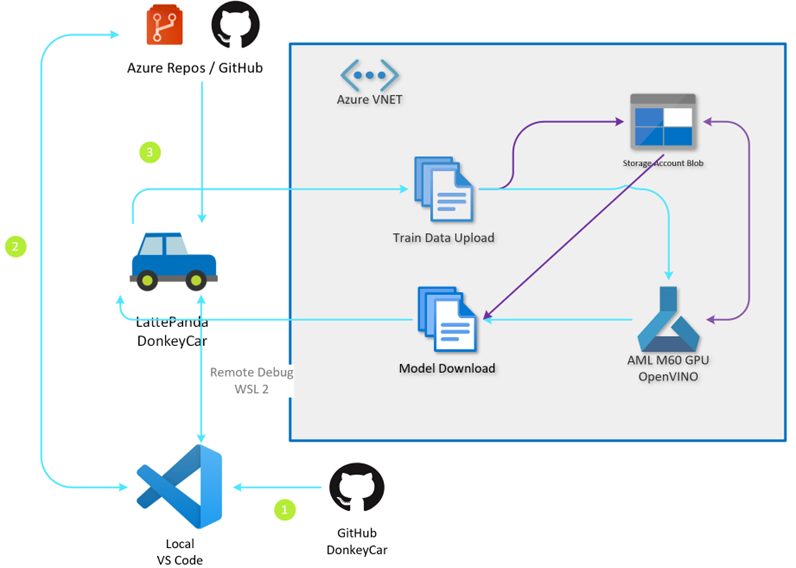
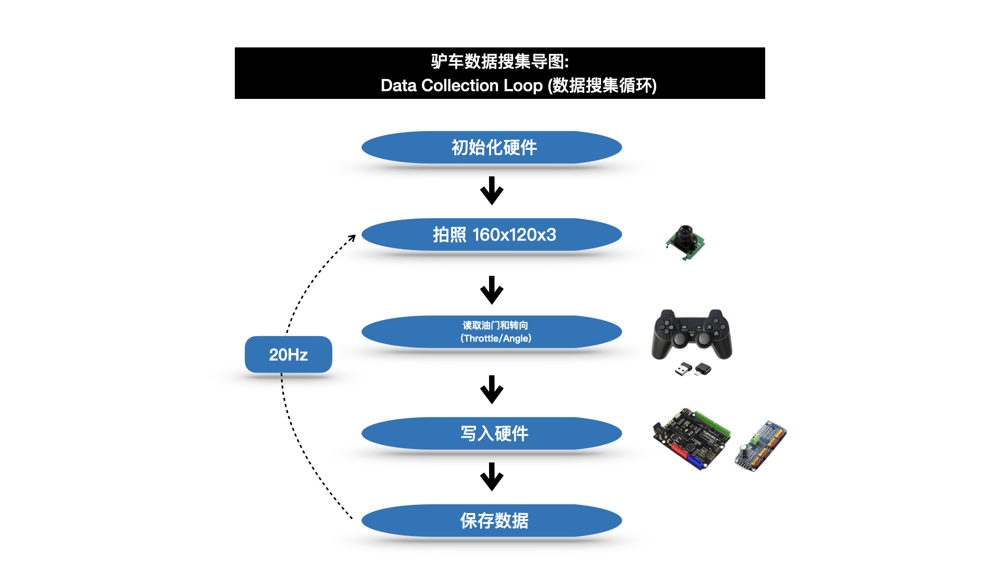
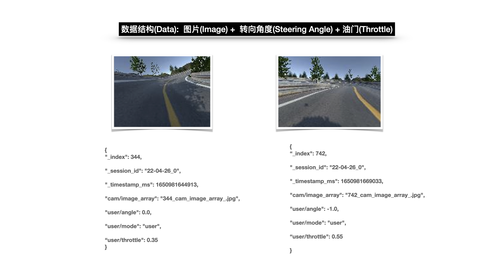
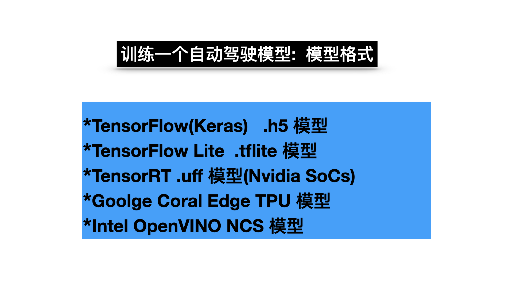
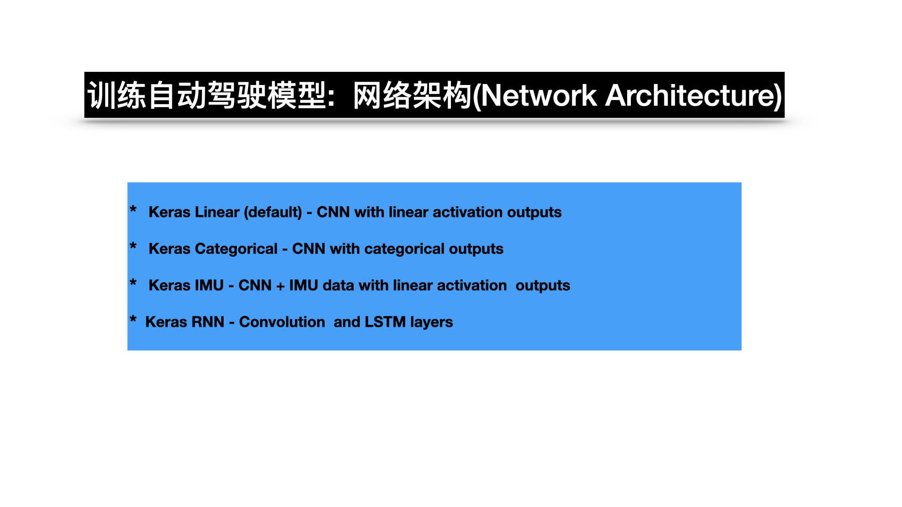

# 软件架构
##  核心架构体系
驴车的整体架构是通过在 Linux 系统(目前是 Ubuntu 20.04 LTS版本)上构建，通过本地 Python 环境及LattePanda, OpenCV, Tensorflow, Keras, OpenVINO, Arduino，以及云端Azure Machine Learning, Azure DevOps等云服务整合而成。

学习资源

* [资源链接](https://www.microsoft.com/china/azure/hackthon2022/index.html)

操作系统

* OS版本: Ubuntu 20.04 LTS 
* 下载链接: [ Ubuntu 20.04 LTS Desktop](https://releases.ubuntu.com/20.04/)

Python解释器

* 版本: python3.7 
* 下载链接: [python3.7](https://www.python.org/downloads/release/python-3712/)

OpenCV视觉框架

* 版本: 4.5.5.60 (根据实际平台选择安装版本)
* 下载链接: [OpenCV](https://www.opencv.org/)

## 驴车代码解析

软件框架

<b>主程序循环架构</b> 

<b>数据结构</b> 

<b>模型格式</b> 

<b>网络架构</b> 

---
